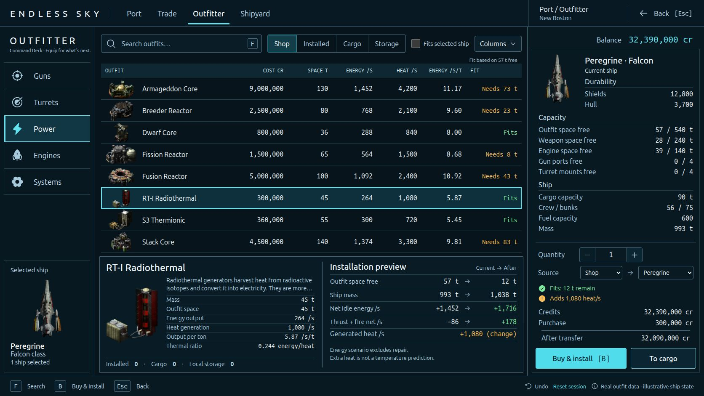

# Endless Sky — Outfitter design prototype

Interactive implementation of the approved expanded-data Outfitter concept. This is a separate React/Vite browser prototype; the native game's C++ source and pilot saves are unchanged.



[Approved design](design/reference.png) · [Design QA](design-qa.md) · [Artwork and data provenance](asset-provenance.md)

## Included

- Twenty real outfits across Power, Guns, Turrets, Engines and Systems.
- Original game thumbnails and Falcon artwork; bundled Ubuntu fonts and Phosphor interface icons.
- Search, category selection, sortable columns, fit filtering and column visibility controls.
- Current-to-after previews for equipment transfers, quantities, credits and direct ship-capacity/energy effects.
- Shop, installed, cargo and local-storage inventories; purchase, install, uninstall, move and sell operations.
- Capacity and inventory validation, keyboard navigation, undo and session reset.

The initial ship configuration is illustrative. Its existing equipment is represented by baseline statistics; the installed inventory tracks catalog items added during this session. All prices are base catalog prices. Repair, cooling efficiency, temperature, licenses, depreciation and full flight simulation are outside the prototype model. Nothing is persisted to game files or browser storage.

## Development

Use Node.js 20.19+ or 22.12+ and npm. This prototype was validated with Node.js 22.14.0.

From the repository root:

```sh
cd prototypes/outfitter
npm ci
npm run dev -- --host 127.0.0.1 --port 4176 --strictPort
```

After starting the development server, open http://127.0.0.1:4176/. If that port is already in use, choose another with the `--port` flag. The prototype does not require building the native game.

To build or run the transaction checks, use another terminal in `prototypes/outfitter`:

```sh
npm run build
node tests/model.test.mjs
```

## Key files

- `src/App.jsx`: interface and interaction state.
- `src/styles.css`: visual design and responsive layouts.
- `src/catalog.js`: verified game data and original artwork paths.
- `src/model.mjs`: immutable preview and transfer calculations.
- `tests/model.test.mjs`: meaningful transfer-model checks.
- `design-qa.md`: visual comparison, interaction evidence and validation limits.
- `asset-provenance.md`: original game artwork/data authorship and licensing.
- `public/assets/fonts/LICENSE.txt`: Ubuntu font licensing.

Approved visual reference: `design/reference.png`.

The Product Design starter's hosting files remain intact, but this prototype has not been published. Browser verification and QA were completed locally.
